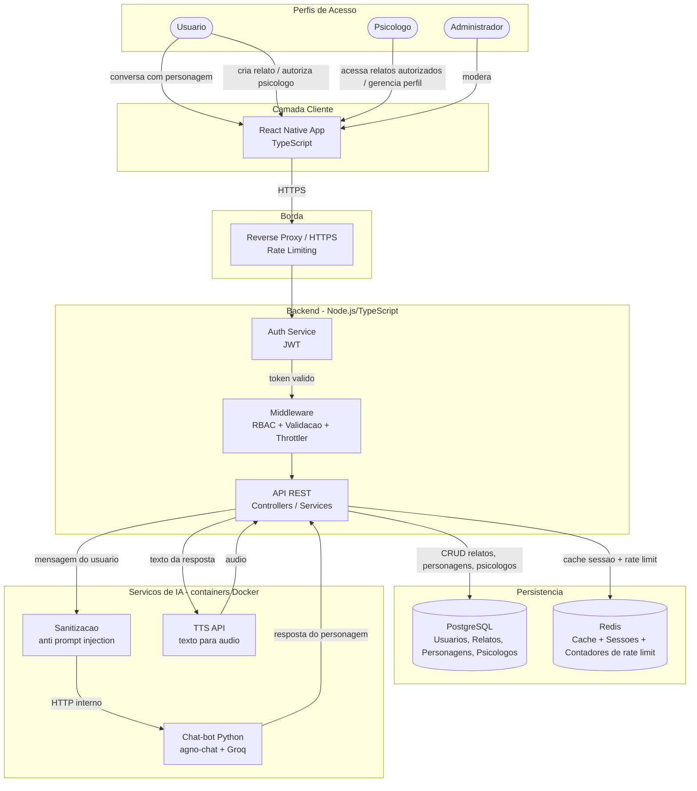
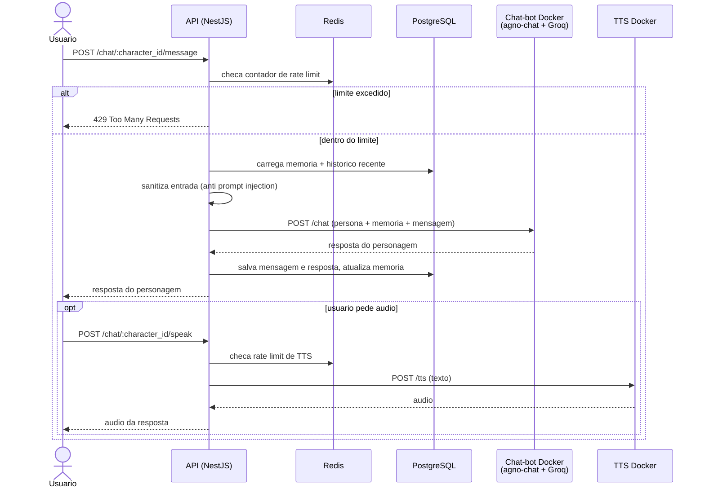
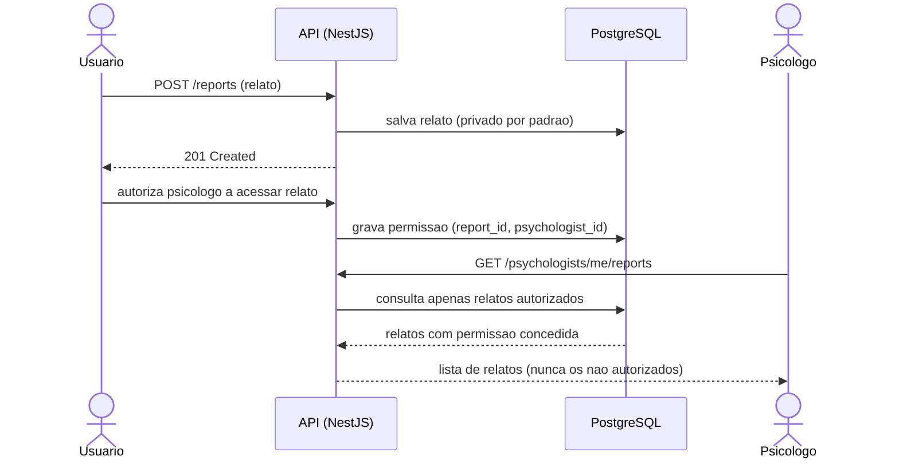
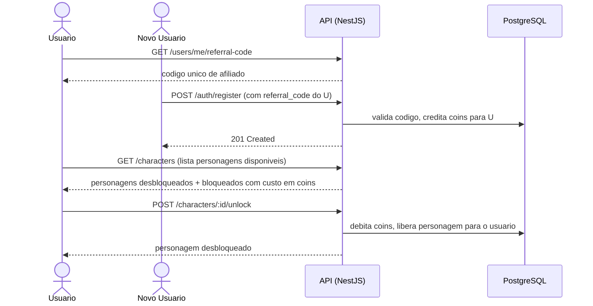
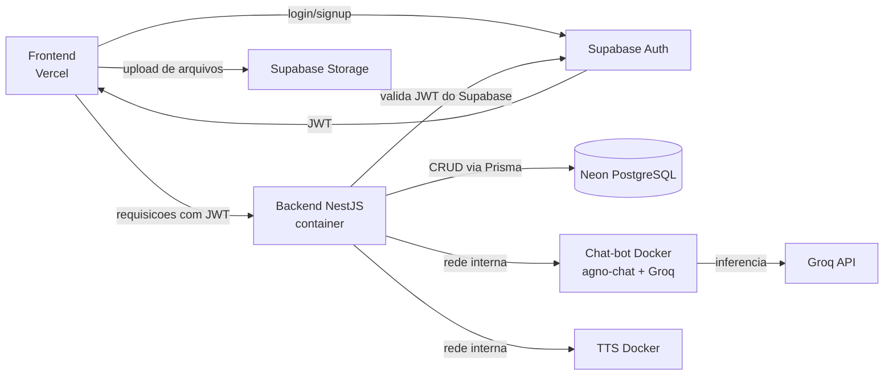

# PSYCHO-LIBERTAIRE — Plataforma de Apoio, Escuta e Conexão

PSYCHO-LIBERTAIRE é uma plataforma de saúde mental que combina três pilares: uma **sala de desabafo privada com personagens de IA** para apoio emocional imediato, um **diretório de psicólogos** para conexão com profissionais habilitados, e um **sistema de acompanhamento controlado** onde o usuário autoriza o psicólogo a acessar seus relatos dentro do app. O projeto combina backend em TypeScript/NestJS, aplicativo mobile em React Native, um **serviço de chat-bot em Python (agno-chat + Groq) rodando em container Docker** e um **serviço de TTS exposto como API em Docker** para leitura das respostas em voz.

<p align="center">


</p>

## Objetivos

* Oferecer apoio emocional imediato via conversa com personagens de IA, cada um com personalidade própria.
* Permitir que o usuário desbloqueie novos personagens através de um sistema de coins ganhos por indicação.
* Preservar a privacidade dos usuários por padrão — relatos nunca são expostos sem autorização explícita.
* Conectar usuários a psicólogos reais através de um diretório pesquisável com perfis profissionais completos.
* Permitir que o usuário autorize um psicólogo a acessar seus relatos dentro do app, de forma controlada e reversível.
* Disponibilizar uma API REST estável para comunicação entre frontend, serviço de chat-bot e serviço de TTS.
* Proteger os serviços de IA (chat e TTS) com rate limiting e sanitização de entrada.

---

## Os Três Pilares do Produto

### 1. Sala de Desabafo com Personagens IA
Cada usuário tem uma sala privada onde pode escolher um personagem de IA para conversar. Cada personagem tem uma personalidade distinta, mantém **memória de contexto** ao longo da conversa e responde de forma coerente com sua personalidade. As respostas podem ser ouvidas em áudio através do **serviço de TTS**. Novos personagens são desbloqueados via sistema de coins.

### 2. Sistema de Coins e Afiliados
O usuário ganha coins ao divulgar seu código de afiliado. Quando outra pessoa usa esse código ao se cadastrar, os coins são creditados automaticamente na conta de quem indicou. Os coins são usados para desbloquear novos personagens de IA na sala de desabafo — mecânica central de gamificação da plataforma.

### 3. Diretório de Psicólogos + Acompanhamento
Psicólogos se cadastram com seus dados profissionais (CRP, especialidades, contato). Usuários pesquisam e encontram profissionais dentro do app. Se o usuário quiser, pode autorizar um psicólogo específico a acessar seus relatos dentro da plataforma — autorização explícita, controlada e reversível.

---

## Serviços de IA

A inteligência da plataforma não roda dentro do backend NestJS. Ela vive em **dois serviços independentes, ambos containerizados com Docker**, chamados pelo backend via HTTP interno.

### Chat-bot (agno-chat + Groq)

O chat-bot foi construído com **agno-chat**, usando o **Groq Console / API da Groq** como provedor de inferência. O serviço é escrito em **Python** e **dockerizado**, exposto como uma API HTTP que o backend NestJS consome.

* Cada personagem é um agente do agno-chat com seu próprio prompt de personalidade.
* A memória de contexto é montada a partir de `character_memory` + histórico recente de `chat_messages`, e enviada ao agente a cada requisição.
* O backend nunca expõe a chave da Groq ao cliente — toda chamada passa pelo serviço Python.
* Entrada sanitizada antes de chegar ao agente (anti prompt injection).

```text
POST /chat        # recebe { user_id, character_id, message, memory, history } e devolve a resposta do personagem
GET  /health      # healthcheck do container
```

### TTS (API em Docker)

O **TTS é uma API rodando em Docker**, separada do chat-bot. Recebe o texto da resposta do personagem e devolve o áudio correspondente, que o app reproduz na sala de desabafo.

* Serviço isolado em container próprio, orquestrado junto dos demais no `docker-compose`.
* Chamado sob demanda — o áudio só é gerado quando o usuário pede para ouvir a resposta.
* Sujeito a rate limiting próprio, já que é o serviço mais caro em processamento.

```text
POST /tts         # recebe { text, voice } e devolve o áudio sintetizado
GET  /health      # healthcheck do container
```

> **Nota:** não há personagens ou vozes temáticas de anime na plataforma. As vozes são apenas perfis neutros do serviço de TTS.

---

## MVPs do Produto

O desenvolvimento é dividido em duas entregas principais, priorizando primeiro a experiência do usuário final com os personagens de IA, e só depois as ferramentas voltadas ao psicólogo.

### MVP 1 — Conversa com IA, Memória, Voz e Gamificação
Foco no pilar de engajamento do usuário: a sala de desabafo e tudo que a cerca.
* Chat com personagens de IA (agno-chat + Groq), com personalidade própria por personagem.
* **Memória de conversa** — o personagem retém contexto relevante entre mensagens (e idealmente entre sessões), não apenas o histórico bruto.
* **TTS** — leitura em voz das respostas via API dockerizada.
* **Rate limiting** no chat e no TTS, por usuário e por IP.
* Gamificação: sistema de coins, desbloqueio progressivo de novos personagens.
* Sistema de afiliados: código de indicação, crédito automático de coins.
* Autenticação e perfil básico do usuário.
* Layout adaptável para telas menores (smartphones).

### MVP 2 — Ferramentas para Psicólogos e Acompanhamento
Foco no pilar profissional, construído sobre a base do MVP 1.
* Cadastro e perfil profissional do psicólogo (CRP, especialidades, bio, contato).
* Diretório público de busca de psicólogos.
* Relatos do usuário (criação, privacidade por padrão).
* Autorização controlada de relatos para psicólogo (e revogação).
* Dashboard/ferramentas de acompanhamento para o psicólogo acessar apenas os relatos autorizados.
* *E mais funcionalidades a definir conforme o produto evolui.*

---

## Arquitetura

### Visão geral dos componentes



### Fluxo do chat com personagem (com rate limit, memória e TTS)



### Fluxo de autorização (usuário para psicólogo)

O usuário controla quem vê seus relatos. Um psicólogo só enxerga relatos explicitamente autorizados — nunca por padrão.



### Fluxo do sistema de coins e afiliados



### Arquitetura Modular do Backend (padrão NestJS)

O backend segue a **arquitetura modular padrão do NestJS** — a mesma estrutura gerada pela CLI (`nest generate module/controller/service`). Cada domínio vira um módulo independente com o padrão **Controller → Service → Prisma**:

* O **Controller** recebe a requisição HTTP, valida o DTO e chama o Service. Não tem regra de negócio.
* O **Service** concentra a regra de negócio e acessa o banco via Prisma.
* O **Module** declara e conecta tudo, e é importado pelo `AppModule`.
* Os serviços de IA (chat-bot e TTS) são consumidos por *providers* HTTP dedicados (`ChatBotClient`, `TtsClient`), isolando o backend da implementação em Python.

---

## Stack Tecnológica

| Camada | Tecnologia |
| :--- | :--- |
| Backend | Node.js, TypeScript, NestJS, Passport (JWT), Swagger (`@nestjs/swagger`) |
| ORM | Prisma |
| Persistência | PostgreSQL |
| Cache / Sessões / Rate limit | Redis (`@nestjs/cache-manager`, storage do `@nestjs/throttler`) |
| Validação | class-validator + class-transformer |
| Testes | Jest |
| Frontend | React Native, TypeScript, Expo |
| Chat-bot | **Python + agno-chat + Groq (Groq Console/API)**, empacotado como API HTTP em container Docker |
| TTS | **API de TTS dockerizada**, container próprio, consumida pelo backend |
| Infraestrutura (dev) | Docker, Docker Compose (Postgres, Redis, chat-bot, TTS) |
| Infraestrutura (produção) | Neon (PostgreSQL serverless), Supabase (Auth/JWT + Storage), Vercel (deploy do frontend), host de containers para backend/chat-bot/TTS |

---

## Modelo de Dados (proposta inicial)

| Tabela | Campos principais | Observações |
| :--- | :--- | :--- |
| `users` | id, email, senha_hash, nome, role, coins, referral_code, criado_em | `role`: USER, PROFESSIONAL, ADMIN |
| `referrals` | id, referrer_id, referred_id, coins_awarded, criado_em | Registro de cada indicacao bem-sucedida |
| `characters` | id, nome, personalidade, descricao, custo_coins, voz_tts, ativo | `voz_tts`: perfil de voz usado pela API de TTS |
| `user_characters` | user_id, character_id, desbloqueado_em | Personagens desbloqueados por cada usuario |
| `chat_messages` | id, user_id, character_id, role, conteudo, criado_em | Historico de conversa (role: user ou assistant) |
| `character_memory` | id, user_id, character_id, resumo, atualizado_em | *(MVP 1)* Fatos/resumos extraídos da conversa para dar memória de longo prazo ao personagem sem reprocessar todo o histórico bruto |
| `reports` | id, user_id, conteudo, privacidade, criado_em | Privado por padrão |
| `psychologists` | id, user_id, crp, especialidades, bio, contato, verificado | Perfil profissional |
| `report_permissions` | report_id, psychologist_id, autorizado_em | Autorizacao explicita de acesso |

---

## Principais Funcionalidades

### Usuário
* Cadastro e login.
* Sala de desabafo: escolhe um personagem e conversa via IA, com memória de contexto.
* Ouvir a resposta do personagem em áudio (TTS).
* Desbloqueio de novos personagens com coins.
* Ganho de coins ao indicar novos usuários via código de afiliado.
* Criação de relatos pessoais (privados por padrão).
* Autorização controlada para psicólogo acessar relatos.
* Busca e visualização de perfis de psicólogos.

### Psicólogo
* Cadastro com dados profissionais (CRP, especialidades, bio, contato).
* Gerenciamento do próprio perfil (CRUD).
* Acesso somente aos relatos explicitamente autorizados pelo usuário.

### Administração
* Gerenciamento de usuários e psicólogos.
* Verificação de cadastros profissionais.
* Moderação de conteúdo.
* Ajuste dos limites de rate limiting dos serviços de IA.

---

## API

Padrão REST, versionada em `/api/v1`, com documentação automática via Swagger em `/api/docs`.

### Autenticação
```text
POST   /api/v1/auth/register              # aceita referral_code opcional
POST   /api/v1/auth/login
POST   /api/v1/auth/refresh
```

### Usuário
```text
GET    /api/v1/users/me
PATCH  /api/v1/users/me
GET    /api/v1/users/me/referral-code     # retorna codigo de afiliado do usuario
GET    /api/v1/users/me/coins             # saldo de coins
```

### Personagens
```text
GET    /api/v1/characters                 # lista todos (desbloqueados e bloqueados)
POST   /api/v1/characters/:id/unlock      # desbloqueia com coins
```

### Chat (sala de desabafo)
```text
POST   /api/v1/chat/:character_id/message # envia mensagem, recebe resposta do personagem (rate limited)
POST   /api/v1/chat/:character_id/speak   # gera audio da resposta via TTS (rate limited)
GET    /api/v1/chat/:character_id/history # historico da conversa com aquele personagem
```

### Relatos
```text
POST   /api/v1/reports
GET    /api/v1/reports
GET    /api/v1/reports/:id
PATCH  /api/v1/reports/:id
DELETE /api/v1/reports/:id
POST   /api/v1/reports/:id/authorize      # autoriza psicologo a ver o relato
DELETE /api/v1/reports/:id/authorize/:psychologist_id  # revoga autorizacao
```

### Psicólogos
```text
GET    /api/v1/psychologists              # busca publica de psicologos
GET    /api/v1/psychologists/:id          # perfil publico
POST   /api/v1/psychologists              # psicologo cria seu perfil
PATCH  /api/v1/psychologists/me           # psicologo atualiza seu perfil
GET    /api/v1/psychologists/me/reports   # relatos autorizados para este psicologo
```

---

## Segurança

* RBAC (USER, PROFESSIONAL, ADMIN) via Guards e decorators customizados.
* **Rate limiting no chat** via `@nestjs/throttler` com storage em Redis: limite por usuário autenticado **e** por IP, com janelas curtas (burst) e longas (cota diária). Excedeu, responde `429 Too Many Requests` com `Retry-After`.
* **Rate limiting no TTS**, com limite mais restritivo que o do chat por ser o serviço mais caro.
* Serviços de chat-bot e TTS não são expostos publicamente — só aceitam tráfego da rede interna do Docker, autenticado por chave de serviço.
* Chaves da Groq e credenciais de TTS ficam apenas nas variáveis de ambiente dos containers, nunca no cliente.
* Validação global de entrada com `ValidationPipe` + class-validator.
* Proteção contra SQL Injection via Prisma (queries parametrizadas).
* Sanitização de input antes de qualquer chamada ao chat-bot (anti prompt injection) e limite de tamanho de mensagem.
* Acesso a relatos sempre exige autorização explícita — nunca por padrão.
* Coins nunca creditados duas vezes para o mesmo código de afiliado (idempotência no `ReferralsService`).
* Em produção, autenticação/JWT e senhas passam a ser gerenciadas pelo **Supabase Auth** (ver seção "Ambiente de Produção" abaixo).

---

## Ambiente Local (Docker Compose)

Todos os serviços sobem juntos com um único comando:

```bash
docker compose up -d
```

| Container | Função |
| :--- | :--- |
| `postgres` | Banco de dados local |
| `redis` | Cache, sessões e contadores de rate limit |
| `chatbot` | API Python (agno-chat + Groq) do chat-bot |
| `tts` | API de TTS |
| `api` | Backend NestJS |

Variáveis de ambiente principais:

```env
DATABASE_URL=
REDIS_URL=
GROQ_API_KEY=
CHATBOT_URL=http://chatbot:8000
CHATBOT_SERVICE_KEY=
TTS_URL=http://tts:8001
TTS_SERVICE_KEY=
THROTTLE_CHAT_LIMIT=
THROTTLE_TTS_LIMIT=
```

---

## Ambiente de Produção

| Serviço | Função |
| :--- | :--- |
| **Neon** | Banco de dados PostgreSQL serverless, usado pelo backend (via Prisma) para armazenar usuários, relatos, personagens e psicólogos. Substitui o Postgres do Docker Compose local. |
| **Supabase** | Responsável pela emissão e validação de JWT (Auth) e pelo armazenamento de arquivos (Storage) — por exemplo, fotos de perfil de psicólogos ou anexos de relatos. O fluxo de autenticação do backend (Passport/JWT) passa a validar tokens emitidos pelo Supabase Auth em vez de gerar seus próprios tokens localmente. |
| **Vercel** | Hospeda e faz o deploy contínuo do frontend (build web/Expo), com deploy automático a cada push. |
| **Host de containers** | Backend NestJS, chat-bot (agno-chat + Groq) e TTS rodam como containers em Railway/Render/Fly.io, na mesma rede privada. |

### Fluxo simplificado em produção



| Ambiente | Status |
| :--- | :--- |
| Local | Docker Compose (Postgres + Redis + chat-bot + TTS + API) |
| Staging | Neon (branch de staging) + Supabase (projeto de staging) + Vercel (preview deploy) + containers de staging |
| Produção | Neon (PostgreSQL) + Supabase (Auth/JWT + Storage) + Vercel (frontend) + containers de backend/chat-bot/TTS |

---

## Testes

* **Unitários**: services testados com mock do PrismaService via `Test.createTestingModule()`, sem subir banco. Chamadas ao chat-bot e ao TTS são mockadas nos clients HTTP.
* **E2E**: endpoints críticos cobertos, especialmente o fluxo de autorização de relatos e o fluxo de chat.
* **Rate limiting**: teste que confirma o retorno `429` ao exceder o limite de mensagens no chat e de requisições no TTS.
* **Regressão de segurança obrigatória**: teste que garante que psicólogo nunca acessa relato não autorizado — deve passar antes de qualquer PR que toque no fluxo de permissões.


## CHANGELOG

**Atual**
* Removida qualquer menção a vozes/personagens de anime — as vozes agora são perfis neutros do serviço de TTS.
* **TTS passa a ser uma API dockerizada** em container próprio, com endpoints `/tts` e `/health`, consumida pelo backend e protegida por rate limit.
* **Chat-bot documentado**: construído com **agno-chat** + **Groq (Groq Console/API)**, escrito em **Python** e empacotado como **API em Docker**.
* Nova seção "Serviços de IA" descrevendo chat-bot e TTS como containers independentes do backend.
* Adicionado **rate limiting no chat e no TTS** (`@nestjs/throttler` com storage em Redis, limite por usuário e por IP, resposta `429`), com teste dedicado.
* Nova seção "Ambiente Local (Docker Compose)" com a lista de containers e variáveis de ambiente.
* Novo diagrama de sequência do fluxo de chat (rate limit → memória → sanitização → chat-bot → TTS).
* Endpoint `POST /api/v1/chat/:character_id/speak` adicionado à API.
* Campo `voz_tts` adicionado à tabela `characters`.
* Diagramas de arquitetura e de produção atualizados com os containers de chat-bot e TTS.

**Anterior**
* Nova seção "MVPs do Produto": MVP 1 (chat com personagens de IA, memória de conversa, gamificação, desbloqueio de personagens, sistema de afiliados e layout adaptável para smartphones) e MVP 2 (ferramentas para psicólogos: cadastro/perfil profissional, diretório público, relatos, autorização controlada e dashboard de acompanhamento).
* Tabela `character_memory` no Modelo de Dados.
* Menção à memória de contexto no Pilar 1, na Stack Tecnológica e no diagrama de arquitetura.
