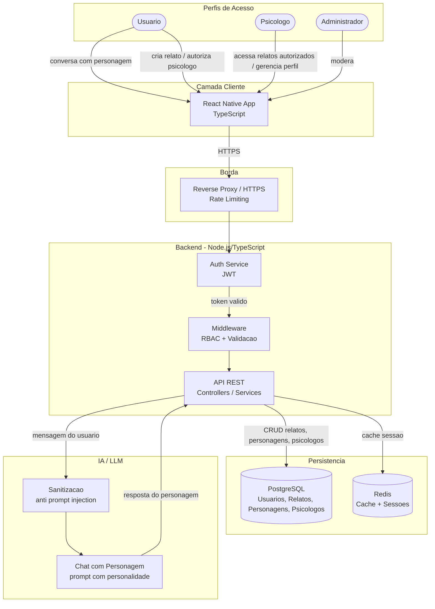
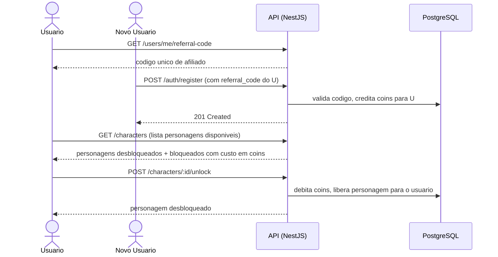

# PSYCHO-LIBERTAIRE — Plataforma de Apoio, Escuta e Conexão

PSYCHO-LIBERTAIRE é uma plataforma de saúde mental que combina três pilares: uma **sala de desabafo privada com personagens de IA** para apoio emocional imediato, um **diretório de psicólogos** para conexão com profissionais habilitados, e um **sistema de acompanhamento controlado** onde o usuário autoriza o psicólogo a acessar seus relatos dentro do app. O projeto combina backend em TypeScript/NestJS, aplicativo mobile em React Native e integração com LLM para os personagens de IA.

<p align="center">
  <a href="http://nestjs.com/" target="blank"></a>
</p>

## Objetivos

* Oferecer apoio emocional imediato via conversa com personagens de IA, cada um com personalidade própria.
* Permitir que o usuário desbloqueie novos personagens através de um sistema de coins ganhos por indicação.
* Preservar a privacidade dos usuários por padrão — relatos nunca são expostos sem autorização explícita.
* Conectar usuários a psicólogos reais através de um diretório pesquisável com perfis profissionais completos.
* Permitir que o usuário autorize um psicólogo a acessar seus relatos dentro do app, de forma controlada e reversível.
* Disponibilizar uma API REST estável para comunicação entre frontend e backend.

---

## Os Três Pilares do Produto

### 1. Sala de Desabafo com Personagens IA
Cada usuário tem uma sala privada onde pode escolher um personagem de IA para conversar. Cada personagem tem uma personalidade distinta e responde de forma coerente com ela. Novos personagens são desbloqueados via sistema de coins.

### 2. Sistema de Coins e Afiliados
O usuário ganha coins ao divulgar seu código de afiliado. Quando outra pessoa usa esse código ao se cadastrar, o coins são creditados automaticamente na conta de quem indicou. Os coins são usados para desbloquear novos personagens de IA na sala de desabafo.

### 3. Diretório de Psicólogos + Acompanhamento
Psicólogos se cadastram com seus dados profissionais (CRP, especialidades, contato). Usuários pesquisam e encontram profissionais dentro do app. Se o usuário quiser, pode autorizar um psicólogo específico a acessar seus relatos dentro da plataforma — autorização explícita, controlada e reversível.

---

## Arquitetura

### Visão geral dos componentes



### Fluxo de autorização (usuário para psicólogo)

O usuário controla quem vê seus relatos. Um psicólogo só enxerga relatos explicitamente autorizados — nunca por padrão.


### Fluxo do sistema de coins e afiliados



### Arquitetura Modular do Backend (padrão NestJS)

O backend segue a **arquitetura modular padrão do NestJS** — a mesma estrutura gerada pela CLI (`nest generate module/controller/service`). Cada domínio vira um módulo independente com o padrão **Controller → Service → Prisma**:

* O **Controller** recebe a requisição HTTP, valida o DTO e chama o Service. Não tem regra de negócio.
* O **Service** concentra a regra de negócio e acessa o banco via Prisma.
* O **Module** declara e conecta tudo, e é importado pelo `AppModule`.

---

## Stack Tecnológica

| Camada | Tecnologia |
| :--- | :--- |
| Backend | Node.js, TypeScript, NestJS, Passport (JWT), Swagger (`@nestjs/swagger`) |
| ORM | Prisma |
| Persistência | PostgreSQL |
| Cache / Sessões | Redis (`@nestjs/cache-manager`) |
| Validação | class-validator + class-transformer |
| Testes | Jest |
| Frontend | React Native, TypeScript, Expo |
| IA / LLM | API de LLM externa (OpenAI ou similar) com prompt de personalidade por personagem |
| Infraestrutura | Docker, Docker Compose |

---

## Estrutura do Projeto

### Backend

```text
backend/
├── src/
│   ├── auth/                          # Autenticacao JWT, guards, strategies (Passport)
│   │   ├── dto/
│   │   ├── guards/
│   │   ├── strategies/
│   │   ├── decorators/
│   │   ├── auth.controller.ts
│   │   ├── auth.service.ts
│   │   └── auth.module.ts
│   │
│   ├── users/                         # Usuarios: perfil, coins, codigo de afiliado
│   │   ├── dto/
│   │   ├── entities/
│   │   ├── users.controller.ts
│   │   ├── users.service.ts
│   │   └── users.module.ts
│   │
│   ├── reports/                       # Relatos: CRUD, privacidade, autorizacao
│   │   ├── dto/
│   │   ├── entities/
│   │   ├── reports.controller.ts
│   │   ├── reports.service.ts
│   │   └── reports.module.ts
│   │
│   ├── characters/                    # Personagens de IA: listagem, desbloqueio, chat
│   │   ├── dto/
│   │   ├── entities/
│   │   ├── characters.controller.ts
│   │   ├── characters.service.ts
│   │   └── characters.module.ts
│   │
│   ├── chat/                          # Conversa com personagem via LLM
│   │   ├── dto/
│   │   ├── chat.controller.ts
│   │   ├── chat.service.ts            # Monta prompt com personalidade + chama LLM
│   │   └── chat.module.ts
│   │
│   ├── psychologists/                 # Psicologos: cadastro, perfil, busca, acesso a relatos
│   │   ├── dto/
│   │   ├── entities/
│   │   ├── psychologists.controller.ts
│   │   ├── psychologists.service.ts
│   │   └── psychologists.module.ts
│   │
│   ├── referrals/                     # Sistema de afiliados e coins
│   │   ├── dto/
│   │   ├── referrals.controller.ts
│   │   ├── referrals.service.ts
│   │   └── referrals.module.ts
│   │
│   ├── shared/                        # Guards globais, filtros de excecao, helpers
│   ├── config/                        # Variaveis de ambiente (@nestjs/config)
│   ├── prisma/                        # PrismaService + PrismaModule
│   ├── app.module.ts
│   └── main.ts
├── prisma/
│   └── schema.prisma
├── test/
├── Dockerfile
├── docker-compose.yml
├── nest-cli.json
├── package.json
├── tsconfig.json
└── .env.example
```

### Frontend

```text
frontend/
├── src/
│   ├── components/
│   ├── screens/
│   │   ├── auth/
│   │   ├── chat/           # Sala de desabafo + selecao de personagem
│   │   ├── reports/        # Relatos e autorizacoes
│   │   ├── psychologists/  # Busca e perfil de psicologos
│   │   └── profile/        # Perfil, coins, codigo de afiliado
│   ├── services/
│   ├── hooks/
│   ├── navigation/
│   ├── types/
│   └── utils/
├── assets/
├── package.json
└── tsconfig.json
```

---

## Modelo de Dados (proposta inicial)

| Tabela | Campos principais | Observações |
| :--- | :--- | :--- |
| `users` | id, email, senha_hash, nome, role, coins, referral_code, criado_em | `role`: USER, PROFESSIONAL, ADMIN |
| `referrals` | id, referrer_id, referred_id, coins_awarded, criado_em | Registro de cada indicacao bem-sucedida |
| `characters` | id, nome, personalidade, descricao, custo_coins, ativo | Personagens de IA disponíveis na plataforma |
| `user_characters` | user_id, character_id, desbloqueado_em | Personagens desbloqueados por cada usuario |
| `chat_messages` | id, user_id, character_id, role, conteudo, criado_em | Historico de conversa (role: user ou assistant) |
| `reports` | id, user_id, conteudo, privacidade, criado_em | Privado por padrão |
| `psychologists` | id, user_id, crp, especialidades, bio, contato, verificado | Perfil profissional |
| `report_permissions` | report_id, psychologist_id, autorizado_em | Autorizacao explicita de acesso |

---

## Principais Funcionalidades

### Usuário
* Cadastro e login.
* Sala de desabafo: escolhe um personagem e conversa via IA.
* Desbloqueio de novos personagens com coins.
* Ganho de coins ao indicar novos usuários via código de afiliado.
* Criação de relatos pessoais (privados por padrão).
* Autorização controlada para psicólogo acessar relatos.
* Busca e visualização de perfis de psicólogos.

### Psicólogo
* Cadastro com dados profissionais (CRP, especialidades, bio, contato).
* Gerenciamento do próprio perfil (CRUD).
* Acesso somente aos relatos explicitamente autorizados pelo usuário.

### Administração
* Gerenciamento de usuários e psicólogos.
* Verificação de cadastros profissionais.
* Moderação de conteúdo.

---

## API

Padrão REST, versionada em `/api/v1`, com documentação automática via Swagger em `/api/docs`.

### Autenticação
```text
POST   /api/v1/auth/register              # aceita referral_code opcional
POST   /api/v1/auth/login
POST   /api/v1/auth/refresh
```

### Usuário
```text
GET    /api/v1/users/me
PATCH  /api/v1/users/me
GET    /api/v1/users/me/referral-code     # retorna codigo de afiliado do usuario
GET    /api/v1/users/me/coins             # saldo de coins
```

### Personagens
```text
GET    /api/v1/characters                 # lista todos (desbloqueados e bloqueados)
POST   /api/v1/characters/:id/unlock      # desbloqueia com coins
```

### Chat (sala de desabafo)
```text
POST   /api/v1/chat/:character_id/message # envia mensagem, recebe resposta do personagem
GET    /api/v1/chat/:character_id/history # historico da conversa com aquele personagem
```

### Relatos
```text
POST   /api/v1/reports
GET    /api/v1/reports
GET    /api/v1/reports/:id
PATCH  /api/v1/reports/:id
DELETE /api/v1/reports/:id
POST   /api/v1/reports/:id/authorize      # autoriza psicologo a ver o relato
DELETE /api/v1/reports/:id/authorize/:psychologist_id  # revoga autorizacao
```

### Psicólogos
```text
GET    /api/v1/psychologists              # busca publica de psicologos
GET    /api/v1/psychologists/:id          # perfil publico
POST   /api/v1/psychologists             # psicologo cria seu perfil
PATCH  /api/v1/psychologists/me          # psicologo atualiza seu perfil
GET    /api/v1/psychologists/me/reports  # relatos autorizados para este psicologo
```

---

## Segurança

* JWT com expiração curta e refresh token via Passport.
* RBAC (USER, PROFESSIONAL, ADMIN) via Guards e decorators customizados.
* Senhas com hash argon2, nunca em texto plano.
* Rate limiting via `@nestjs/throttler`.
* Validação global de entrada com `ValidationPipe` + class-validator.
* Proteção contra SQL Injection via Prisma (queries parametrizadas).
* Sanitização de input antes de qualquer chamada ao LLM (anti prompt injection).
* Acesso a relatos sempre exige autorização explícita — nunca por padrão.
* Coins nunca creditados duas vezes para o mesmo código de afiliado (idempotência no `ReferralsService`).

---

## Ambientes

| Ambiente | Status |
| :--- | :--- |
| Local | Docker Compose (único existente) |
| Staging | Não existe ainda |
| Produção | Não existe ainda |

---

## Testes

* **Unitários**: services testados com mock do PrismaService via `Test.createTestingModule()`, sem subir banco.
* **E2E**: endpoints críticos cobertos, especialmente o fluxo de autorização de relatos.
* **Regressão de segurança obrigatória**: teste que garante que psicólogo nunca acessa relato não autorizado — deve passar antes de qualquer PR que toque no fluxo de permissões.

---

## Roadmap

### Fase 1 — MVP Core
- [ ] Setup do ambiente (Docker, Postgres, Redis)
- [ ] Auth (registro com referral_code opcional, login, JWT)
- [ ] Módulo de usuários (perfil, coins, código de afiliado)
- [ ] Módulo de personagens (listagem, desbloqueio com coins)
- [ ] Chat com personagem via LLM (sala de desabafo)
- [ ] Sistema de afiliados (rastreamento de código, crédito de coins)

### Fase 2 — Relatos e Psicólogos
- [ ] Módulo de relatos (CRUD, privacidade)
- [ ] Cadastro e perfil de psicólogos
- [ ] Busca pública de psicólogos
- [ ] Autorização controlada de relatos para psicólogo
- [ ] Teste de regressão de segurança do fluxo de autorização

### Fase 3 — Qualidade e Produção
- [ ] Testes automatizados completos
- [ ] CI/CD
- [ ] Observabilidade (logging estruturado, métricas)
- [ ] Testes de segurança
- [ ] Revisão de conformidade legal (LGPD)
- [ ] Publicação

---

## Status Atual

Projeto em desenvolvimento. Documentação e arquitetura definidas. Implementação iniciada pelo backend (NestJS + Prisma).****
