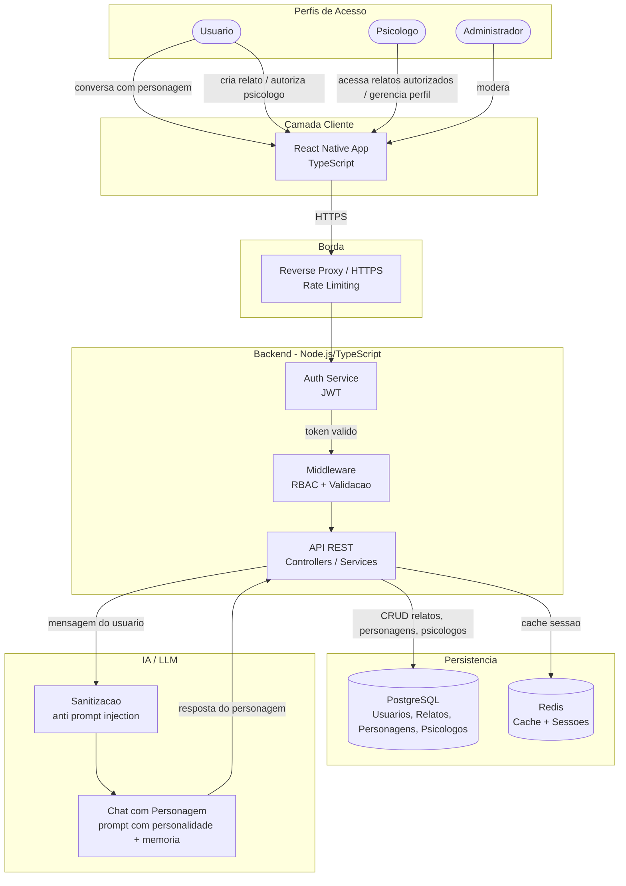
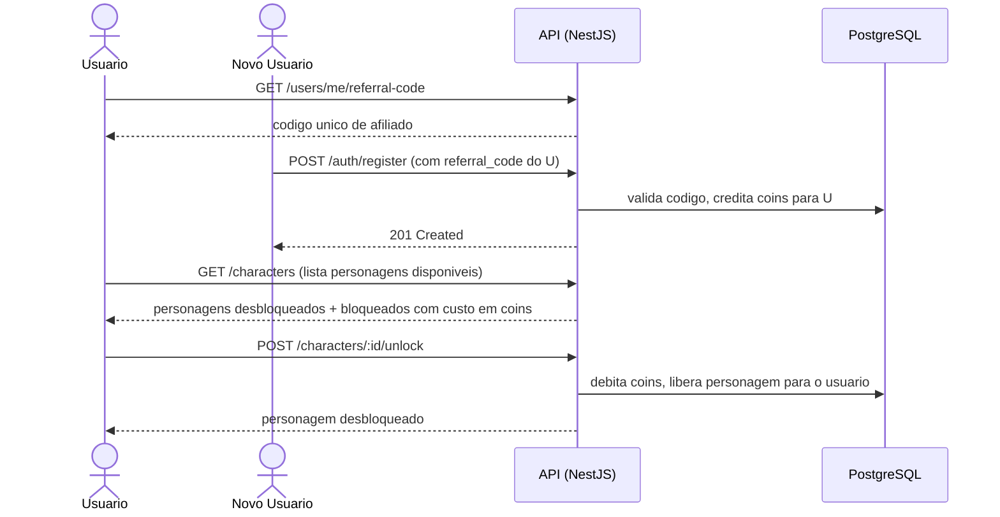
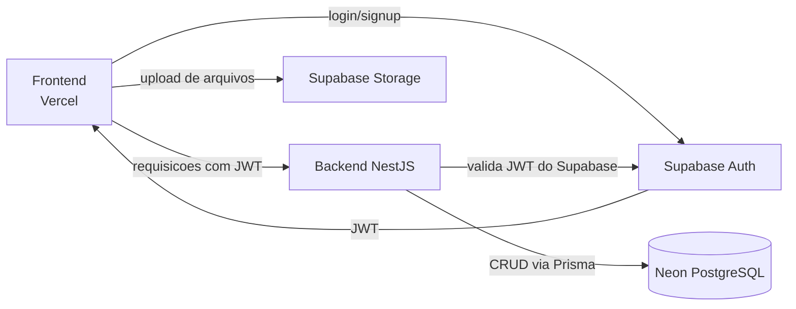

# PSYCHO-LIBERTAIRE — Plataforma de Apoio, Escuta e Conexão

PSYCHO-LIBERTAIRE é uma plataforma de saúde mental que combina três pilares: uma **sala de desabafo privada com personagens de IA** para apoio emocional imediato, um **diretório de psicólogos** para conexão com profissionais habilitados, e um **sistema de acompanhamento controlado** onde o usuário autoriza o psicólogo a acessar seus relatos dentro do app. O projeto combina backend em TypeScript/NestJS, aplicativo mobile em React Native e integração com LLM para os personagens de IA.

<p align="center">
  <a href="http://nestjs.com/" target="blank"></a>
</p>

## Objetivos

* Oferecer apoio emocional imediato via conversa com personagens de IA, cada um com personalidade própria.
* Permitir que o usuário desbloqueie novos personagens através de um sistema de coins ganhos por indicação.
* Preservar a privacidade dos usuários por padrão — relatos nunca são expostos sem autorização explícita.
* Conectar usuários a psicólogos reais através de um diretório pesquisável com perfis profissionais completos.
* Permitir que o usuário autorize um psicólogo a acessar seus relatos dentro do app, de forma controlada e reversível.
* Disponibilizar uma API REST estável para comunicação entre frontend e backend.

---

## Os Três Pilares do Produto

### 1. Sala de Desabafo com Personagens IA
Cada usuário tem uma sala privada onde pode escolher um personagem de IA para conversar. Cada personagem tem uma personalidade distinta, mantém **memória de contexto** ao longo da conversa e responde de forma coerente com sua personalidade. Novos personagens são desbloqueados via sistema de coins.

### 2. Sistema de Coins e Afiliados
O usuário ganha coins ao divulgar seu código de afiliado. Quando outra pessoa usa esse código ao se cadastrar, os coins são creditados automaticamente na conta de quem indicou. Os coins são usados para desbloquear novos personagens de IA na sala de desabafo — mecânica central de gamificação da plataforma.

### 3. Diretório de Psicólogos + Acompanhamento
Psicólogos se cadastram com seus dados profissionais (CRP, especialidades, contato). Usuários pesquisam e encontram profissionais dentro do app. Se o usuário quiser, pode autorizar um psicólogo específico a acessar seus relatos dentro da plataforma — autorização explícita, controlada e reversível.

---

## MVPs do Produto

O desenvolvimento é dividido em duas entregas principais, priorizando primeiro a experiência do usuário final com os personagens de IA, e só depois as ferramentas voltadas ao psicólogo.

### MVP 1 — Conversa com IA, Memória e Gamificação
Foco no pilar de engajamento do usuário: a sala de desabafo e tudo que a cerca.
* Chat com personagens de IA, com personalidade própria por personagem.
* **Memória de conversa** — o personagem retém contexto relevante entre mensagens (e idealmente entre sessões), não apenas o histórico bruto.
* Gamificação: sistema de coins, desbloqueio progressivo de novos personagens.
* Sistema de afiliados: código de indicação, crédito automático de coins.
* Autenticação e perfil básico do usuário.

### MVP 2 — Ferramentas para Psicólogos e Acompanhamento
Foco no pilar profissional, construído sobre a base do MVP 1.
* Cadastro e perfil profissional do psicólogo (CRP, especialidades, bio, contato).
* Diretório público de busca de psicólogos.
* Relatos do usuário (criação, privacidade por padrão).
* Autorização controlada de relatos para psicólogo (e revogação).
* Dashboard/ferramentas de acompanhamento para o psicólogo acessar apenas os relatos autorizados.
* *E mais funcionalidades a definir conforme o produto evolui.*

---

## Arquitetura

### Visão geral dos componentes



### Fluxo de autorização (usuário para psicólogo)

O usuário controla quem vê seus relatos. Um psicólogo só enxerga relatos explicitamente autorizados — nunca por padrão.


### Fluxo do sistema de coins e afiliados



### Arquitetura Modular do Backend (padrão NestJS)

O backend segue a **arquitetura modular padrão do NestJS** — a mesma estrutura gerada pela CLI (`nest generate module/controller/service`). Cada domínio vira um módulo independente com o padrão **Controller → Service → Prisma**:

* O **Controller** recebe a requisição HTTP, valida o DTO e chama o Service. Não tem regra de negócio.
* O **Service** concentra a regra de negócio e acessa o banco via Prisma.
* O **Module** declara e conecta tudo, e é importado pelo `AppModule`.

---

## Stack Tecnológica

| Camada | Tecnologia |
| :--- | :--- |
| Backend | Node.js, TypeScript, NestJS, Passport (JWT), Swagger (`@nestjs/swagger`) |
| ORM | Prisma |
| Persistência | PostgreSQL |
| Cache / Sessões | Redis (`@nestjs/cache-manager`) |
| Validação | class-validator + class-transformer |
| Testes | Jest |
| Frontend | React Native, TypeScript, Expo |
| IA / LLM | API de LLM externa (OpenAI ou similar) com prompt de personalidade por personagem + memória de contexto |
| Infraestrutura (dev) | Docker, Docker Compose |
| Infraestrutura (produção) | Neon (PostgreSQL serverless), Supabase (Auth/JWT + Storage), Vercel (deploy do frontend) |

---

## Modelo de Dados (proposta inicial)

| Tabela | Campos principais | Observações |
| :--- | :--- | :--- |
| `users` | id, email, senha_hash, nome, role, coins, referral_code, criado_em | `role`: USER, PROFESSIONAL, ADMIN |
| `referrals` | id, referrer_id, referred_id, coins_awarded, criado_em | Registro de cada indicacao bem-sucedida |
| `characters` | id, nome, personalidade, descricao, custo_coins, ativo | Personagens de IA disponíveis na plataforma |
| `user_characters` | user_id, character_id, desbloqueado_em | Personagens desbloqueados por cada usuario |
| `chat_messages` | id, user_id, character_id, role, conteudo, criado_em | Historico de conversa (role: user ou assistant) |
| `character_memory` | id, user_id, character_id, resumo, atualizado_em | *(MVP 1)* Fatos/resumos extraídos da conversa para dar memória de longo prazo ao personagem sem reprocessar todo o histórico bruto |
| `reports` | id, user_id, conteudo, privacidade, criado_em | Privado por padrão |
| `psychologists` | id, user_id, crp, especialidades, bio, contato, verificado | Perfil profissional |
| `report_permissions` | report_id, psychologist_id, autorizado_em | Autorizacao explicita de acesso |

---

## Principais Funcionalidades

### Usuário
* Cadastro e login.
* Sala de desabafo: escolhe um personagem e conversa via IA, com memória de contexto.
* Desbloqueio de novos personagens com coins.
* Ganho de coins ao indicar novos usuários via código de afiliado.
* Criação de relatos pessoais (privados por padrão).
* Autorização controlada para psicólogo acessar relatos.
* Busca e visualização de perfis de psicólogos.

### Psicólogo
* Cadastro com dados profissionais (CRP, especialidades, bio, contato).
* Gerenciamento do próprio perfil (CRUD).
* Acesso somente aos relatos explicitamente autorizados pelo usuário.

### Administração
* Gerenciamento de usuários e psicólogos.
* Verificação de cadastros profissionais.
* Moderação de conteúdo.

---

## API

Padrão REST, versionada em `/api/v1`, com documentação automática via Swagger em `/api/docs`.

### Autenticação
```text
POST   /api/v1/auth/register              # aceita referral_code opcional
POST   /api/v1/auth/login
POST   /api/v1/auth/refresh
```

### Usuário
```text
GET    /api/v1/users/me
PATCH  /api/v1/users/me
GET    /api/v1/users/me/referral-code     # retorna codigo de afiliado do usuario
GET    /api/v1/users/me/coins             # saldo de coins
```

### Personagens
```text
GET    /api/v1/characters                 # lista todos (desbloqueados e bloqueados)
POST   /api/v1/characters/:id/unlock      # desbloqueia com coins
```

### Chat (sala de desabafo)
```text
POST   /api/v1/chat/:character_id/message # envia mensagem, recebe resposta do personagem
GET    /api/v1/chat/:character_id/history # historico da conversa com aquele personagem
```

### Relatos
```text
POST   /api/v1/reports
GET    /api/v1/reports
GET    /api/v1/reports/:id
PATCH  /api/v1/reports/:id
DELETE /api/v1/reports/:id
POST   /api/v1/reports/:id/authorize      # autoriza psicologo a ver o relato
DELETE /api/v1/reports/:id/authorize/:psychologist_id  # revoga autorizacao
```

### Psicólogos
```text
GET    /api/v1/psychologists              # busca publica de psicologos
GET    /api/v1/psychologists/:id          # perfil publico
POST   /api/v1/psychologists             # psicologo cria seu perfil
PATCH  /api/v1/psychologists/me          # psicologo atualiza seu perfil
GET    /api/v1/psychologists/me/reports  # relatos autorizados para este psicologo
```

---

## Segurança

* RBAC (USER, PROFESSIONAL, ADMIN) via Guards e decorators customizados.
* Rate limiting via `@nestjs/throttler`.
* Validação global de entrada com `ValidationPipe` + class-validator.
* Proteção contra SQL Injection via Prisma (queries parametrizadas).
* Sanitização de input antes de qualquer chamada ao LLM (anti prompt injection).
* Acesso a relatos sempre exige autorização explícita — nunca por padrão.
* Coins nunca creditados duas vezes para o mesmo código de afiliado (idempotência no `ReferralsService`).
* Em produção, autenticação/JWT e senhas passam a ser gerenciadas pelo **Supabase Auth** (ver seção "Ambiente de Produção" abaixo).

---

## Ambiente de Produção

O ambiente de produção é composto por três serviços gerenciados, substituindo o setup local baseado em Docker Compose:

| Serviço | Função |
| :--- | :--- |
| **Neon** | Banco de dados PostgreSQL serverless, usado pelo backend (via Prisma) para armazenar usuários, relatos, personagens e psicólogos. Substitui o Postgres do Docker Compose local. |
| **Supabase** | Responsável pela emissão e validação de JWT (Auth) e pelo armazenamento de arquivos (Storage) — por exemplo, fotos de perfil de psicólogos ou anexos de relatos. O fluxo de autenticação do backend (Passport/JWT) passa a validar tokens emitidos pelo Supabase Auth em vez de gerar seus próprios tokens localmente. |
| **Vercel** | Hospeda e faz o deploy contínuo do frontend (build web/Expo), com deploy automático a cada push. |

### Fluxo simplificado em produção



| Ambiente | Status |
| :--- | :--- |
| Local | Docker Compose (Postgres + Redis locais) |
| Staging | Neon (branch de staging) + Supabase (projeto de staging) + Vercel (preview deploy) |
| Produção | Neon (PostgreSQL) + Supabase (Auth/JWT + Storage) + Vercel (frontend) |

> **Observação:** o backend (NestJS) continua precisando de um host próprio para rodar a API (por exemplo Railway, Render ou Fly.io), já que o Vercel neste desenho cobre apenas o deploy do frontend. Ajuste esse ponto caso o backend já tenha um provedor definido.

---

## Testes

* **Unitários**: services testados com mock do PrismaService via `Test.createTestingModule()`, sem subir banco.
* **E2E**: endpoints críticos cobertos, especialmente o fluxo de autorização de relatos.
* **Regressão de segurança obrigatória**: teste que garante que psicólogo nunca acessa relato não autorizado — deve passar antes de qualquer PR que toque no fluxo de permissões.

---

## Roadmap

### MVP 1 — Conversa com IA, Memória e Gamificação
- [ ] Setup do ambiente (Docker local / Neon + Supabase em produção)
- [ ] Auth (registro com referral_code opcional, login via Supabase Auth)
- [ ] Módulo de usuários (perfil, coins, código de afiliado)
- [ ] Módulo de personagens (listagem, desbloqueio com coins)
- [ ] Chat com personagem via LLM (sala de desabafo)
- [ ] Memória de conversa por personagem (`character_memory`)
- [ ] Sistema de afiliados (rastreamento de código, crédito de coins)

### MVP 2 — Ferramentas para Psicólogos e Acompanhamento
- [ ] Módulo de relatos (CRUD, privacidade)
- [ ] Cadastro e perfil de psicólogos
- [ ] Busca pública de psicólogos
- [ ] Autorização controlada de relatos para psicólogo
- [ ] Teste de regressão de segurança do fluxo de autorização
- [ ] Dashboard/ferramentas adicionais para o psicólogo (a definir)

### Fase 3 — Qualidade e Produção
- [ ] Testes automatizados completos
- [ ] CI/CD
- [ ] Deploy do backend em host próprio (Railway/Render/Fly.io) conectado ao Neon
- [ ] Deploy do frontend na Vercel com preview deploys
- [ ] Observabilidade (logging estruturado, métricas)
- [ ] Testes de segurança
- [ ] Revisão de conformidade legal (LGPD)
- [ ] Publicação

---
#CHANGELOG 

Nova seção "MVPs do Produto", dividindo a entrega em:
MVP 1 — chat com personagens de IA, memória de conversa, gamificação (coins), desbloqueio de personagens e sistema de afiliados,LAYOUT ADAPTÁVEL PARA TELAS MENORES COMO SMARTPHONES 
MVP 2 — ferramentas para psicólogos: cadastro/perfil profissional, diretório público, relatos, autorização controlada e dashboard de acompanhamento.
Tabela character_memory no Modelo de Dados, para dar memória de longo prazo aos personagens sem depender apenas do histórico bruto (chat_messages).
Menção à memória de contexto no Pilar 1 ("Sala de Desabafo com Personagens IA"), na Stack Tecnológica (linha de IA/LLM) e no diagrama de arquitetura (nó CHAT).
Linha final na seção Status Atual indicando que a prioridade atual é o MVP 1.
